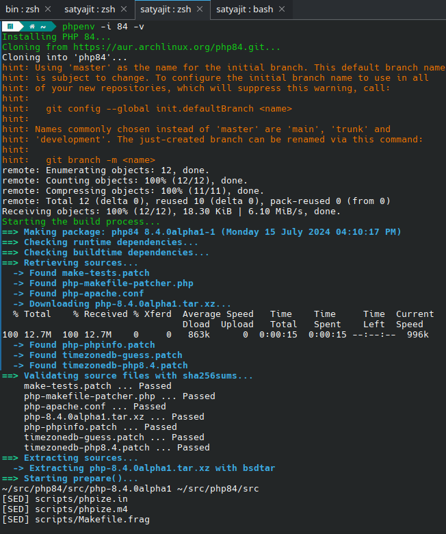
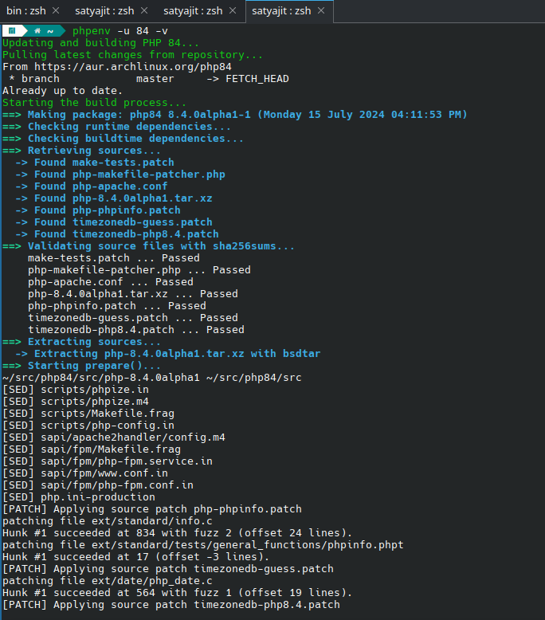

# Install and Switch between Any PHP on Arch / Manjaro / EndeavourOS / Garuda Linux / ArcoLinux.

### Documentation

#### Overview

The `phpenv` script is designed to manage and switch between different PHP versions on your Arch Linux, Manjaro, EndeavourOS, Garuda Linux, ArcoLinux, or any other Arch-based Linux system. It can install new PHP versions from the Arch User Repository (AUR) and update existing installations. This document provides detailed instructions on using the script effectively.

##### Switch PHP Versions


##### Install PHP Versions



#### Update PHP Versions



#### Prerequisites

Before using the script, ensure that your system meets the following requirements:

-   **Operating Systems:** Arch Linux, Manjaro, EndeavourOS, Garuda Linux, ArcoLinux, or any other Arch-based distribution.
-   **Required Tools**: `git`, `makepkg`, `pacman`

#### Installation

1. **Download and Save the Script**

    Save the script to a file named `phpenv` in a directory included in your `PATH`, such as `$HOME/bin`. Ensure the script is executable:

    ```bash
    chmod +x $HOME/bin/phpenv
    ```

2. **Ensure Necessary Tools are Installed**

    The script requires `git` and `makepkg` to function. These tools are usually pre-installed on distribution. Verify their presence using:

    ```bash
    which git makepkg
    ```

3. **Update PATH Environment Variable**

    Ensure that `$HOME/bin` is included in your `PATH` by adding the following line to your `~/.bashrc`, `~/.zshrc`, or the relevant shell configuration file:

    ```bash
    export PATH="$HOME/bin:$PATH"
    ```

    After updating the configuration file, reload it with:

    ```bash
    source ~/.bashrc  # or source ~/.zshrc
    ```

#### Script Usage

The script supports several modes of operation:

1. **Install a New PHP Version**

    To install a new PHP version from the AUR, use the `-i` flag followed by the version number:

    ```bash
    phpenv -i [VERSION]
    ```

    Example:

    ```bash
    phpenv -i 83
    ```

    This command installs the specified PHP version and creates symbolic links in `$HOME/bin` pointing to its binaries.

2. **Update and Build an Existing PHP Version**

    To update and rebuild an existing PHP version from the AUR, use the `-u` flag followed by the version number:

    ```bash
    phpenv -u [VERSION]
    ```

    Example:

    ```bash
    phpenv -u 83
    ```

    This command updates the specified PHP version by pulling the latest changes from its repository and rebuilding it.

3. **Verbose Output Mode**

    To enable verbose mode and get detailed logging of the script’s actions, use the `-v` flag:

    ```bash
    phpenv -v [VERSION]
    ```

    Example:

    ```bash
    phpenv -v 83
    ```

    This command provides detailed output of the script’s operations during installation or update.

4. **Dry Run Mode**

    To perform a dry run and see what the script would do without making any changes, use the `--dry-run` flag:

    ```bash
    phpenv --dry-run [VERSION]
    ```

    Example:

    ```bash
    phpenv --dry-run -i 83
    ```

    This command shows the steps the script would take to install or update the specified PHP version without actually performing any actions.

5. **Help Information**

    To display usage information and exit, use the `-h` or `--help` flag:

    ```bash
    phpenv -h
    ```

    This command displays the usage information for the script.

#### Detailed Script Walkthrough

The `phpenv` script performs the following steps during execution:

1. **Initialization and Debug Mode**

    - The script initializes and enables debug mode if `DEBUG` is set. It defines color variables for terminal output formatting.

2. **Argument Parsing**

    - It parses command-line arguments to determine whether to install (`-i` flag) or update (`-u` flag) a PHP version. Additional options include verbose output (`-v`), dry-run (`--dry-run`), and help (`-h` or `--help`).

3. **Tool and Dependency Checks**

    - The script checks if essential tools (`git` and `makepkg`) are installed using `command -v`. It displays an error and exits if any tool is missing.

4. **PHP Installation**

    - If installing (`-i` flag), the script clones the AUR repository for the specified PHP version, navigates to the directory, and builds the package using `makepkg -si`.

5. **PHP Update and Build**

    - If updating (`-u` flag), the script navigates to the existing PHP version's directory, pulls the latest changes from its repository using `git pull`, and rebuilds the package using `makepkg -si`.

6. **Symbolic Link Creation**

    - After installation or update, the script removes existing symbolic links in `$HOME/bin` for PHP binaries and creates new links pointing to the specified PHP version's binaries.

7. **Output and Verification**

    - Finally, the script prints a success message indicating that PHP $VERSION has been successfully installed or updated. It verifies the activation by displaying the PHP version using `php -v`.

#### Troubleshooting

For common issues encountered while using the `phpenv` script, refer to the troubleshooting section in the [documentation](#troubleshooting).

#### Additional Resources

For more information on installing and managing PHP versions on Arch-based distributions, refer to Butler's [Install PHP on Arch/Manjaro](https://gist.github.com/michaelbutler/4a89bb23e2d30f1b0585b98d2b67cf55) guide from where I inspired to build this script.

#### Uploading `c-client` PKGBUILD and Prebuilt Package

If you encounter difficulties installing `c-client`, you can download the `c-client` PKGBUILD and a prebuilt package (`c-client-2007f-20-x86_64.pkg.tar.zst`) from the following links:

-   [Download `c-client` PKGBUILD](https://github.com/Its-Satyajit/phpenv/blob/main/c-client/PKGBUILD)
-   [Download Prebuilt `c-client` Package](https://github.com/Its-Satyajit/phpenv/blob/main/c-client/c-client-2007f-20-x86_64.pkg.tar.zst)

Ensure to verify the integrity of the prebuilt package using VirusTotal or another trusted source before installation.

Here are the checksums for `c-client-2007f-20-x86_64.pkg.tar.zst`:

-   **MD5:** 96d92a8b98afd78d2f2c80f8b0d76473
-   **SHA1:** 4451582984bf02b1b78425b75100ca20018c8557
-   **SHA256:** c6c9a0a411f476be1357f5aad8db897ce4d47f3f78757acd2aade3e477e2fe4d
-   **SHA512:** 9628031b0f0efe4024c515f0a882418d7665b3267644f3bf0f12adbc5f200a9cca3049ab218be176ae8562673edca46190ca44de1154a32e0bf828028470ef1e

    VirusTotal for prebuilt c-client-2007f-20-x86_64.pkg.tar.zst: [link](https://www.virustotal.com/gui/file/c6c9a0a411f476be1357f5aad8db897ce4d47f3f78757acd2aade3e477e2fe4d?nocache=1)
