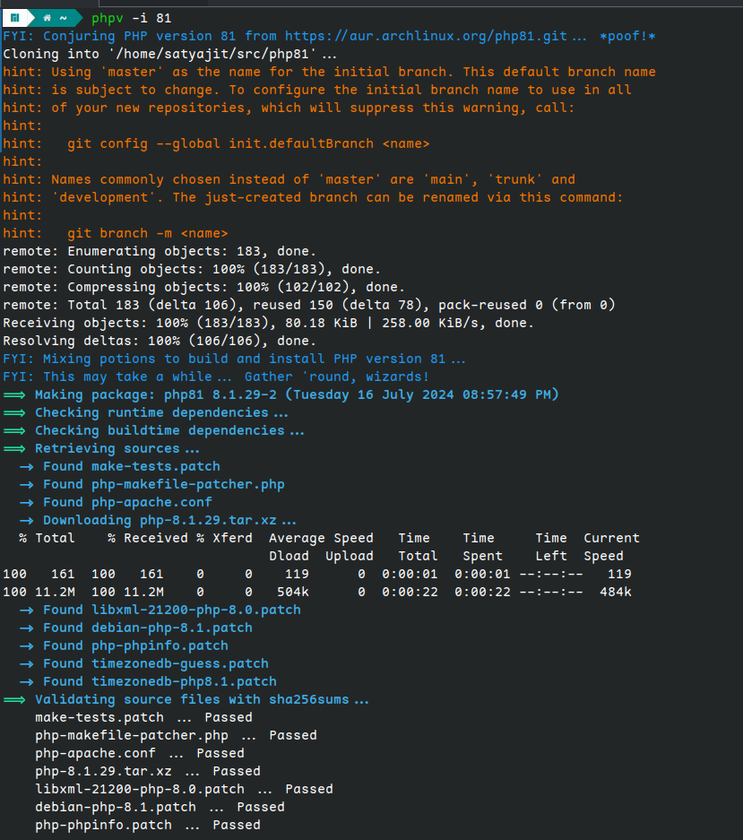
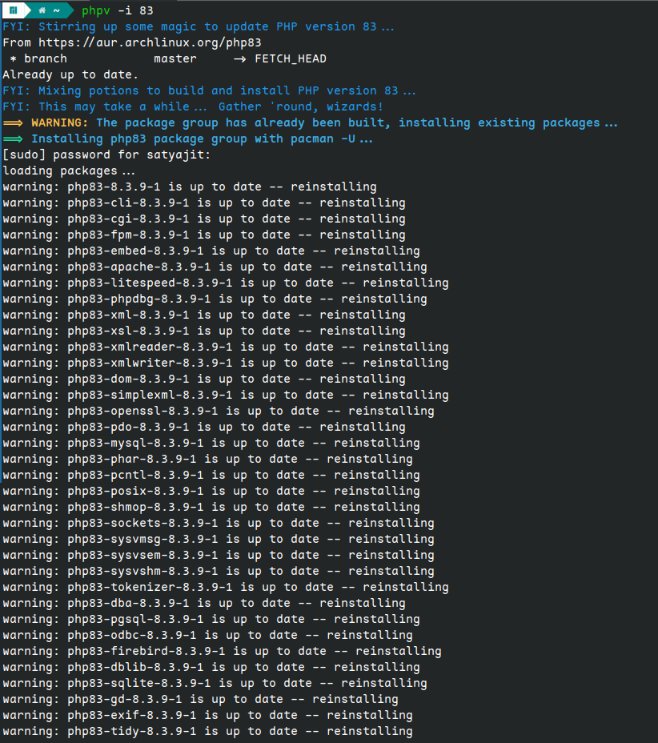
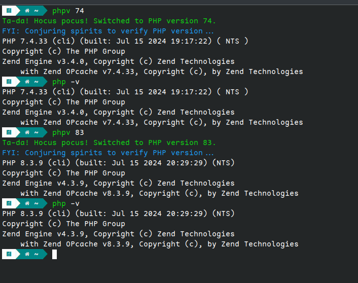

## PHP Version Management Using PHPV on Arch Linux

### Introduction

Managing PHP versions on Arch Linux systems (including Manjaro, EndeavourOS, Garuda Linux, and ArcoLinux) can be challenging. This comprehensive tutorial introduces PHPV, a tool designed to simplify the process of installing, updating, and switching PHP versions efficiently. Follow these steps to streamline your PHP version management on Arch Linux.

### Installation Guide

#### Downloading PHPV

For a quick and efficient installation, use the following command:

```bash
curl -sSL https://raw.githubusercontent.com/Its-Satyajit/phpv/main/install.sh | bash
```

**Tip:** Ensure you have `curl` installed on your system. If not, install it using `sudo pacman -S curl`.

#### Manual Installation (Optional)

Follow these steps for manual installation:

1. **Clone the Repository:**

    ```bash
    git clone https://github.com/Its-Satyajit/phpv.git
    ```

    **Suggestion:** Verify that `git` is installed. If not, install it with `sudo pacman -S git`.

2. **Navigate and Grant Permissions:**

    ```bash
    cd phpv
    chmod +x phpv
    ```

    **Tip:** Always check the permissions of the script before executing it to ensure it’s safe to run.

3. **Install PHPV:**

    ```bash
    mv phpv $HOME/bin/phpv
    ```

    **Suggestion:** If `$HOME/bin` does not exist, create it using `mkdir -p $HOME/bin`.

4. **Update Shell Configuration:**

    Add the following line to your shell configuration file (e.g., ~/.bashrc, ~/.bash_profile):

    ```bash
    export PATH="$HOME/bin:$PATH"
    ```

    **Tip:** Use a text editor like `nano` or `vim` to edit your shell configuration file. For example, `nano ~/.bashrc`.

5. **Refresh Terminal:**

    ```bash
    source ~/.bashrc  # Replace with your appropriate shell command
    ```

    **Suggestion:** If you use a different shell, update the corresponding configuration file (e.g., `~/.zshrc` for Zsh).

### Usage

#### Installing/Updating/Reinstalling PHP Versions

To install, update, or reinstall PHP versions, use the following command:

```bash
phpv -i <version>
```

Replace `<version>` with the desired shorthand (e.g., 80 for 8.0, 74 for 7.4).

**Tip:** Always check for the latest PHP versions and their shorthand notations to keep your environment up to date.

**Install**



**Update/Reinstall**



#### Smart Install (Binary Support)

By default, `phpv` tries to install prebuilt binaries using `pacman` (if available in your configured repositories, like Chaotic-AUR). This saves time by avoiding compilation.

If a prebuilt binary is not found, it automatically falls back to building from the AUR.

#### Force Build from Source

If you prefer to compile from source (skipping the binary check), use the `--build` (or `-b`) flag:

```bash
phpv -i <version> --build
```

Example: `phpv -i 81 -b`

#### Installing PHP Extensions

To install PHP extensions (e.g., imagick, redis) for a specific PHP version, use the `-e` flag:

```bash
phpv -e <extension> <version>
```

Example: `phpv -e imagick 81` will install `php81-imagick` from the AUR.

#### Switching PHP Versions

To switch PHP versions, use the following command:

```bash
phpv <version>
```

Replace `<version>` with the desired shorthand.

**Suggestion:** After switching versions, verify the PHP version with `php -v` to ensure the correct version is active.

**Switch**



### Troubleshooting

If you encounter issues with the c-client dependency, follow the steps outlined below for manual installation.

#### Pre-built Binary for Easy Resolution

Download the pre-built c-client binary from PHPV:

-   [c-client-2007f-20-x86_64.pkg.tar.zst](https://github.com/Its-Satyajit/phpv/blob/main/c-client/c-client-2007f-20-x86_64.pkg.tar.zst)

**Verification (Optional):**

Verify the binary's integrity using the following hash values:

-   MD5: 96d92a8b98afd78d2f2c80f8b0d76473
-   SHA1: 4451582984bf02b1b78425b75100ca20018c8557
-   SHA256: c6c9a0a411f476be1357f5aad8db897ce4d47f3f78757acd2aade3e477e2fe4d
-   SHA512: 9628031b0f0efe4024c515f0a882418d7665b3267644f3bf0f12adbc5f200a9cca3049ab218be176ae8562673edca46190ca44de1154a32e0bf828028470ef1e

For additional verification, use VirusTotal.

#### Manual Compilation (Advanced Users Only)

**Disclaimer:** Manual compilation can introduce conflicts with existing system packages. It is recommended to use the pre-built binary or your system's package manager (e.g., pacman) for a safer installation.

**Manual Compilation Steps:**

1. **Gather Your Tools:**

    Ensure you have the necessary development tools installed:

    - `make`
    - A C compiler (e.g., `gcc`)
    - Development headers for system libraries (`pacman -S base-devel`)

    **Suggestion:** Use `sudo pacman -S base-devel` to install essential development tools.

2. **Download the Source Code:**

    Access the official c-client source code repository: [https://gitweb.gentoo.org/repo/gentoo.git/tree/](https://gitweb.gentoo.org/repo/gentoo.git/tree/)

    **Tip:** Always download the latest stable version to ensure compatibility and security.

3. **Unpack the Source:**

    Extract the source code archive:

    ```bash
    tar -zxvf c-client-X.Y.Z.tar.gz
    ```

    Replace `X.Y.Z` with the specific version number.

    **Suggestion:** Use the `ls` command to verify the contents of the extracted directory.

4. **Configure and Build:**

    Navigate into the extracted directory:

    ```bash
    cd c-client-X.Y.Z
    ```

    Configure and build with specific flags:

    ```bash
    CFLAGS="-Wno-error=implicit-function-declaration -Wno-error=incompatible-pointer-types" ./configure
    ```

    **Warning:** Suppressing warnings can mask underlying issues. It is recommended to investigate the cause of these warnings and fix them if possible.

    **Tip:** Use `./configure --help` to see all available configuration options.

5. **Dependency Management:**

    Ensure all necessary dependencies are installed. Use `pacman` to check for missing packages.

    **Suggestion:** Before starting the compilation, use `sudo pacman -Syu` to update your system and installed packages.

6. **Installation:**

    If you choose to proceed with manual installation, use `sudo make install`:

    ```bash
    sudo make install
    ```

    **Tip:** Always review the `Makefile` before running `make install` to understand the installation process.

By following these steps, you can manually compile the c-client library for PHPV. However, for most users, the pre-built binary or using the system's package manager is the recommended approach.
